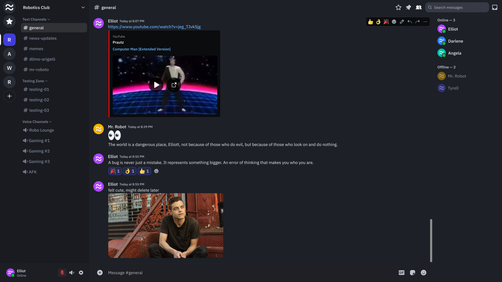

> [!CAUTION]
> As of this writing (15 June 2026), we are working to finalise the API and self-hosting documentation over the next few days.
>
> We apologise for the brief delay in open-source releases. We paused after spam waves created safety concerns while we built out Fluxer's trust and safety infrastructure. During that same stretch, we have been fixing hundreds of bugs, adding new features, and preparing a much improved audio and video system.
>
> You can already try that work in the Fluxer Canary client: [download Canary](https://canary.fluxer.app/download) or [open Canary on the web](https://web.canary.fluxer.app). The latest stable client remains out of date for now, but over the coming weeks we are finalising the remaining work needed to stabilise the current latest code out in the open.

> [!NOTE]
> Learn about the developer behind Fluxer, the goals of the project, the tech stack, and what's coming next.
>
> [Read the launch blog post](https://blog.fluxer.app/how-i-built-fluxer-a-discord-like-chat-app/) | [View full roadmap](https://blog.fluxer.app/roadmap-2026/)

  <picture>
    <source media="(prefers-color-scheme: dark)" srcset="./fluxer_static/marketing/branding/logo-white.svg">
    
  </picture>

  
  
  

# Fluxer

Fluxer is a free and open source instant messaging and VoIP chat app built for friends, groups, and communities.

  

